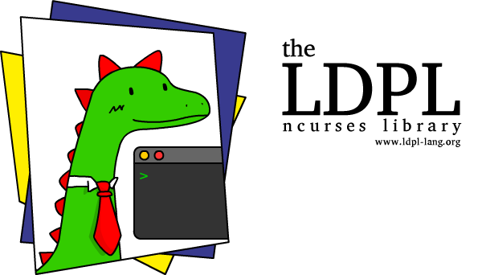

The **LDPL Ncurses Library** is a [ncurses](https://en.wikipedia.org/wiki/Ncurses) wrapper
for LDPL, designed for creating terminal applications that require more complex text
user-interfaces than simple line-feeding. It aims to make it very easy to move text
across a console, change text colors, read user key-presses, etc. This library requires **LDPL 4.4** or greater. For a **LDPL 4.3** compatible version of this library check [this release](https://github.com/Lartu/ldpl-ncurses/releases/tag/1.0).

## 🖼️ Example

The [Lute](https://github.com/lartu/lute) text editor was written using this library.


## 🧰 Installation

Include the library into your LDPL project by copying the folder *ldpl-ncurses* to your project directory and then adding the line:

```coffeescript
include "ldpl-ncurses/ldpl-ncurses.ldpl"
```

before the `data` and `procedure` sections of your source file. The library is
ready to be used.

In order to build against this library, you must have the **libncurses dev** package installed on your system. If you are using Debian Linux or Ubuntu Linux (or any other distribution that uses the **apt** package manager), you may install it by running `apt install libncurses-dev`. Users using other distributions or operating systems should install the package in the ways required by their respective systems. This package is just required to *develop* applications using this library, not to *use* said applications.

## 📚 Documentation

This library adds a number new statements to the language:
- `NC INITIALIZE`
   - Use this statement to initialize this library. This statement **must** be called before any other statements provided by this library are used.
- `NC CLEAN UP`
   - Use this statement to restore the terminal configuration to what it was before calling `NC INITIALIZE`. This statement must be called before the program exits, or else you will end up with a messed up terminal.
- `NC GET SIZE IN <number_var> <number_var>`
   - Use this statement to get the width and height of the terminal in `<number_var>` and `<number_var>`, respectively.
- `NC MOVE TO <number> <number>`
   - Moves the cursor to the column and row defined by the passed numbers, in that order. The upper-left corner of the terminal is the 0, 0 coordinate.
- `NC WRITE <number or text>`
   - Writes the passed text or number at the current cursor position.
- `NC REPAINT`
   - In order to make this library more efficient, it doesn't output anything to the screen until this command is executed, instead it writes all text to a buffer. When this statement is executed, that buffer is copied to the screen.
- `NC SHOW CURSOR`
   - Use this statement to show the console cursor. The cursor is shown by default.
- `NC HIDE CURSOR`
   - Use this statement to hide the console cursor.
- `NC ENABLE COLOR`
   - This statement enables color. Color cannot be disabled once enabled. If this statement is not executed, text color setting will have visible effect.
- `NC SET COLOR <number>`
   - Sets the color of the foreground and background of the text to be printed from now on. `<number>` is expected to be a number (or number variable) between 1 (inclusive) and 56 (inclusive). Check the [Color Guide](https://github.com/Lartu/ldpl-ncurses#-color-guide) section of this document for more information about the available colors.
- `NC GET KEY IN <text variable>`
   - Use this statement to read user input. This statement has two modes: blocking and non-blocking. When on blocking mode, your program will halt until the user presses a key. The value of the key pressed will be stored in the passed text variable. In non-blocking mode, when this statement is executed it will try to read the value of a pressed key and store it in the passed text variable. If no key is pressed, `""` (an empty string) is stored in the variable instead. Check the [Keyboard Character Guide](https://github.com/Lartu/ldpl-ncurses#keyboard-character-guide) section of this document to read about the values stored by this statement in the passed text variable. Input is UTF-8 friendly; if you enter `ñ` or `あ`, you'll get that character in the passed text variable.
- `NC SET NON BLOCKING INPUT`
   - This statement tells LDPL to use non-blocking input. This means that when you call `NC GET KEY IN $`, your program will not wait until a key is pressed and will continue executing had a key been pressed or not. Input is blocking by default.
- `NC SET BLOCKING INPUT`
   - This statement tells LDPL to use blocking input. This means that when you call `NC GET KEY IN $`, your program will hang until a key is pressed. Input is blocking by default.
- `NC SET NON BLOCKING INPUT`
   - This statement tells LDPL to use non-blocking input. This means that when you call `NC GET KEY IN $`, your program will not wait until a key is pressed and will continue executing had a key been pressed or not.
- `NC ENABLE ECHO`
   - Use this statement to print characters as they are typed by the user when accepting input.
- `NC DISABLE ECHO`
   - Use this statement to disable the printing of characters as they are typed by the user when accepting input.
- `NC BOX <number> <number> <number> <number>`
   - Use this statement to draw a box. The box is drawn from its upper-left corner. The passed numbers are: the column of the upper-left corner of the box, the row of the upper-left corner of the box, the width of the box and the height of the box, respectively.
- `NC BOX <text> <number> <number> <number> <number>`
   - Use this statement to draw a box with a title. It works just like `NC BOX`, but the passed text value is used as the title of the box and printed on its upper side.
- `NC SHADOW BOX <number> <number> <number> <number>`
   - This statement is the same as `NC BOX` (without title) but it draws a shadow below its box.
- `NC SHADOW BOX <text> <number> <number> <number> <number>`
   - This statement is the same as `NC BOX` (with title) but it draws a shadow below its box.

## 🎨 Color Guide

The following colors are available when using the `NC SET COLOR $` statement.
The actual colors used depend on the configuration of your terminal.

| Scheme number | Foreground Color | Background Color |
|:-------------:|:----------------:|:----------------:|
| **1**         | RED | BLACK |
| **2**         | GREEN | BLACK |
| **3**         | YELLOW | BLACK |
| **4**         | BLUE | BLACK |
| **5**         | CYAN | BLACK |
| **6**         | MAGENTA | BLACK |
| **7**         | WHITE | BLACK |
| **8**          | GREEN | RED |
| **9**          | YELLOW | RED |
| **10**         | BLUE | RED |
| **11**         | CYAN | RED |
| **12**         | MAGENTA | RED |
| **13**         | WHITE | RED |
| **14**         | BLACK | RED |
| **15**         | RED | GREEN |
| **16**         | YELLOW | GREEN |
| **17**         | BLUE | GREEN |
| **18**         | CYAN | GREEN |
| **19**         | MAGENTA | GREEN |
| **20**         | WHITE | GREEN |
| **21**         | BLACK | GREEN |
| **22**         | RED | YELLOW |
| **23**         | GREEN | YELLOW |
| **24**         | BLUE | YELLOW |
| **25**         | CYAN | YELLOW |
| **26**         | MAGENTA | YELLOW |
| **27**         | WHITE | YELLOW |
| **28**         | BLACK | YELLOW |
| **29**         | RED | BLUE |
| **30**         | GREEN | BLUE |
| **31**         | YELLOW | BLUE |
| **32**         | CYAN | BLUE |
| **33**         | MAGENTA | BLUE |
| **34**         | WHITE | BLUE |
| **35**         | BLACK | BLUE |
| **36**         | RED | CYAN |
| **37**         | GREEN | CYAN |
| **38**         | YELLOW | CYAN |
| **39**         | BLUE | CYAN |
| **40**         | MAGENTA | CYAN |
| **41**         | WHITE | CYAN |
| **42**         | BLACK | CYAN |
| **43**         | RED | MAGENTA |
| **44**         | GREEN | MAGENTA |
| **45**         | YELLOW | MAGENTA |
| **46**         | BLUE | MAGENTA |
| **47**         | CYAN | MAGENTA |
| **48**         | WHITE | MAGENTA |
| **49**         | BLACK | MAGENTA |
| **50**         | RED | WHITE |
| **51**         | GREEN | WHITE |
| **52**         | YELLOW | WHITE |
| **53**         | BLUE | WHITE |
| **54**         | CYAN | WHITE |
| **55**         | MAGENTA | WHITE |
| **56**         | BLACK | WHITE |

## :keyboard: Character Guide

When using the `NC GET KEY IN $` statement, the following characters
and key combinations are considered to be *special* characters. When
we are reading for user input and the user presses these keys, these
are the values that are stored in the text variable passed to the `NC GET KEY IN $`
statement.

| Key | Value Stored |
|:---:|:------------:|
| Up Arrow | `UP` |
| Left Arrow | `LEFT` |
| Right Arrow | `RIGHT` |
| Down Arrow | `DOWN` |
| Page Down | `PAGEDOWN` |
| Page Up | `PAGEUP` |
| Home | `HOME` |
| End | `END` |
| Insert | `INSERT` |
| Delete | `DELETE` |
| Backspace | `BACKSPACE` |
| Enter / Return | `C-M` |
| Control + Q | `C-Q` |
| Control + W | `C-W` |
| Control + E | `C-E` |
| Control + R | `C-R` |
| Control + T | `C-T` |
| Control + Y | `C-Y` |
| Control + I | `C-I` |
| Control + O | `C-O` |
| Control + P | `C-P` |
| Control + A | `C-A` |
| Control + S | `C-S` |
| Control + D | `C-D` |
| Control + F | `C-F` |
| Control + G | `C-G` |
| Control + H | `C-H` |
| Control + J | `C-J` |
| Control + K | `C-K` |
| Control + L | `C-L` |
| Control + Z | `C-Z` |
| Control + X | `C-X` |
| Control + C | `C-C` |
| Control + V | `C-V` |
| Control + B | `C-B` |
| Control + N | `C-N` |
| Control + M | `C-M` |
| Any other key or value | The text value that key represents (for example, if you press **a** you get `a`; if you press **Ö** you get `Ö`). |

## :scroll: License

This library is released under the MIT License.
